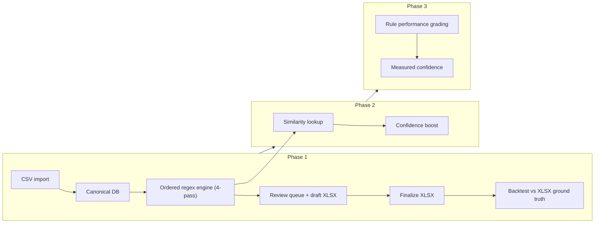

# Bank-agnostic transaction processing system – implementation plan

## Design alignment with your codebase

Your current flow and the base design fit well, with a few concrete adjustments so the system matches [1.0 CreateStandardFilesFromBankDownload (RSA Capital).ipynb](python/PropertyAnalytics_v2/1.0%20CreateStandardFilesFromBankDownload%20(RSA%20Capital).ipynb), [1.5 PopulatePropertyIds.ipynb](python/PropertyAnalytics_v2/1.5%20PopulatePropertyIds.ipynb), [2.0 CategoriseFiles.ipynb](python/PropertyAnalytics_v2/2.0%20CategoriseFiles.ipynb), and [3.0 MonthlySummary OCT25.ipynb](python/PropertyAnalytics_v2/3.0%20MonthlySummary%20OCT25.ipynb).

**Critical constraint:** The monthly summary's `load_data()` expects files in `checked/` named `MMMYYYY_codedAndCategorised.xlsx` (or `.csv`) with **Date as index** and columns **Account, Amount, Subcategory, Memo, Property, Description, Cat, Subcat**. The final output of the new system must produce exactly this schema (and naming) so 3.0 continues to work without change.

**Pipeline consolidation:** The three pipeline notebooks—[1.0 CreateStandardFilesFromBankDownload (RSA Capital).ipynb](python/PropertyAnalytics_v2/1.0%20CreateStandardFilesFromBankDownload%20(RSA%20Capital).ipynb), [1.5 PopulatePropertyIds.ipynb](python/PropertyAnalytics_v2/1.5%20PopulatePropertyIds.ipynb), and [2.0 CategoriseFiles.ipynb](python/PropertyAnalytics_v2/2.0%20CategoriseFiles.ipynb)—must be combined into a **single callable Python program** (e.g. a CLI or library entry point) that runs the same logic in order: (1) 1.0: load four bank CSVs and merge into one date-ordered transaction set; (2) 1.5: populate Property codes via mortgage_map and rent/expense rules and validate against propertyidmap; (3) 2.0: assign Cat (and Description where applicable) then Subcat. The program's output must be **MMMYYYY_codedAndCategorised.xlsx** (and optionally .csv) in the same schema as today so the monthly statement notebook and the new DB-backed pipeline can both consume it. This consolidated program is the reference implementation for the rule engine and for producing the final file until the full DB/confidence/review flow is in place.

---

## 1. Data storage (labels.db) – full schema and usage

The following tables define the complete SQLite layout. All columns and types are specified so the plan is self-contained. **SQLite must be opened in WAL (Write-Ahead Logging) mode** so that reads (e.g. review_month) do not block writes (e.g. a concurrent run_month triggered by the folder watcher).

### 1.1 Table: raw_import_rows

Stores each original bank CSV row exactly for audit and re-import.

| Column          | Type    | Description                                                                                                                       |
| --------------- | ------- | --------------------------------------------------------------------------------------------------------------------------------- |
| raw_row_id      | TEXT    | PRIMARY KEY. Unique per row (e.g. UUID or `{import_batch_id}_{row_number}`).                                                      |
| import_batch_id | TEXT    | Batch identifier (e.g. `MMMYYYY` or `import_2025-10-01T12:00:00`).                                                                |
| source_bank     | TEXT    | `starling` or `barclays`.                                                                                                         |
| source_file     | TEXT    | Original filename (e.g. `BC_4040_NOV2025.csv`).                                                                                   |
| row_number      | INTEGER | Row index in the source file (1-based after header).                                                                              |
| raw_json        | TEXT    | Full CSV row as JSON. For Barclays include Number, Date, Account, Amount, Subcategory, Memo, Memo2 so you can re-import or debug. |
| imported_at     | TEXT    | ISO 8601 timestamp.                                                                                                               |

### 1.2 Table: transactions_canonical

Bank-agnostic fields used for classification and export. One row per transaction; tx_id is the stable key.

| Column                | Type    | Description                                                                                                                                                                                                |
| --------------------- | ------- | ---------------------------------------------------------------------------------------------------------------------------------------------------------------------------------------------------------- |
| tx_id                 | TEXT    | PRIMARY KEY. Deterministic hash -- see section 3 for collision handling.                                                                                                                                   |
| raw_row_id            | TEXT    | FK to raw_import_rows. Nullable for synthetic split rows (see section 3.1).                                                                                                                                |
| import_batch_id       | TEXT    | Same as raw_import_rows.                                                                                                                                                                                   |
| source_bank           | TEXT    | `starling` or `barclays`.                                                                                                                                                                                  |
| source_account        | TEXT    | Your internal account (e.g. `20-74-09 60458872`); used as Account in final XLSX.                                                                                                                           |
| posted_date           | TEXT    | ISO date (YYYY-MM-DD).                                                                                                                                                                                     |
| amount                | REAL    | Signed; negative = outflow.                                                                                                                                                                                |
| currency              | TEXT    | `GBP`.                                                                                                                                                                                                     |
| counterparty          | TEXT    | Nullable (Barclays often has none).                                                                                                                                                                        |
| reference             | TEXT    | Nullable.                                                                                                                                                                                                  |
| memo                  | TEXT    | Nullable; combined counterparty+reference+notes for Starling, merged Memo for Barclays.                                                                                                                    |
| type                  | TEXT    | Nullable (Starling transaction type).                                                                                                                                                                      |
| balance               | REAL    | Nullable (Starling has it).                                                                                                                                                                                |
| bank_txn_number       | TEXT    | Nullable (Barclays "Number").                                                                                                                                                                              |
| bank_category         | TEXT    | Nullable; Starling "Spending Category".                                                                                                                                                                    |
| bank_subcategory      | TEXT    | Nullable; Barclays "Subcategory".                                                                                                                                                                          |
| effective_subcategory | TEXT    | Unified: populated from bank_subcategory (Barclays) or bank_category (Starling). Used by apply_when_json so rules work across both banks -- mirrors how 1.0 renames both to a single "Subcategory" column. |
| match_text            | TEXT    | Computed: `"{counterparty} {reference} {memo} {type}".strip()` for regex rule matching.                                                                                                                    |
| description           | TEXT    | Nullable. Set when a rule implies it (e.g. "Rent for period"); export maps to Description in XLSX.                                                                                                         |
| parent_tx_id          | TEXT    | Nullable. For new-tenancy split rows: references the original tx_id that was superseded. See section 3.1.                                                                                                  |
| is_superseded         | INTEGER | 0 or 1. Set to 1 when a row has been replaced by split rows. Superseded rows are excluded from export.                                                                                                     |
| created_at            | TEXT    | ISO timestamp.                                                                                                                                                                                             |

### 1.3 Table: transactions_labels

Final labels and provenance per transaction. Multiple rows per tx_id when you correct (label_version increments).

| Column           | Type    | Description                                                |
| ---------------- | ------- | ---------------------------------------------------------- |
| tx_id            | TEXT    | FK to transactions_canonical.                              |
| label_version    | INTEGER | Start at 1; increment on each edit.                        |
| property_code    | TEXT    | Maps to Property in XLSX.                                  |
| category         | TEXT    | Maps to Cat (e.g. Mortgage, OurRent, PersonalExpense).     |
| subcategory      | TEXT    | Maps to Subcat (e.g. Tesco, Other).                        |
| source           | TEXT    | `manual` or `rule` or `similarity` or `model` or `hybrid`. |
| confidence       | REAL    | 0..1; meaningful for non-manual.                           |
| rule_id          | TEXT    | Nullable; which rule applied.                              |
| rule_strength    | TEXT    | Nullable; `strong` or `medium` or `weak` or `catch_all`.   |
| needs_review     | INTEGER | 0 or 1.                                                    |
| reviewed         | INTEGER | 0 or 1.                                                    |
| reviewed_at      | TEXT    | Nullable; ISO timestamp.                                   |
| pipeline_version | TEXT    | Optional (e.g. git tag or version string).                 |
| created_at       | TEXT    | ISO timestamp.                                             |

Use the row with highest label_version per tx_id as the current label. Export uses this for Property, Cat, Subcat.

### 1.4 Table: rules

Ordered regex rules with precedence. Engine runs by phase then order_index (first-match-wins per phase, except `override` phase which is unconditional).

| Column          | Type    | Description                                                                                                                                                                                                                                            |
| --------------- | ------- | ------------------------------------------------------------------------------------------------------------------------------------------------------------------------------------------------------------------------------------------------------ |
| rule_id         | TEXT    | PRIMARY KEY (e.g. `prop_mortgage_F1321LON`, `cat_mortgage_1`, `override_interbank_1`).                                                                                                                                                                 |
| order_index     | INTEGER | Order within phase (preserves notebook order).                                                                                                                                                                                                         |
| phase           | TEXT    | `property` or `category` or `subcategory` or `override`. See section 4 for the four-pass engine.                                                                                                                                                       |
| pattern         | TEXT    | Regex applied to match_text (and optionally apply_when fields).                                                                                                                                                                                        |
| outputs_json    | TEXT    | JSON object: any of `property_code`, `category`, `subcategory`, `description`.                                                                                                                                                                         |
| strength        | TEXT    | `strong` or `medium` or `weak` or `catch_all`.                                                                                                                                                                                                         |
| apply_when_json | TEXT    | Nullable. JSON conditions. Supports field regex: `{"field":"effective_subcategory","regex":"Direct Debit or Bill Payment"}`. Supports amount ranges: `{"field":"amount","min":-200,"max":-190}`. Multiple conditions ANDed. See section 4 for details. |
| banks_json      | TEXT    | Nullable. JSON array e.g. `["starling","barclays"]` or null = all.                                                                                                                                                                                     |
| accounts_json   | TEXT    | Nullable. JSON array of source_accounts or null = all.                                                                                                                                                                                                 |
| enabled         | INTEGER | 0 or 1.                                                                                                                                                                                                                                                |

### 1.5 Table: rule_performance

Computed from historical labelled data; used to set base confidence per rule.

| Column           | Type    | Description                                           |
| ---------------- | ------- | ----------------------------------------------------- |
| rule_id          | TEXT    | FK to rules.                                          |
| n_matches        | INTEGER | Count of historical matches.                          |
| acc_category     | REAL    | Accuracy of category vs. reviewed labels (0..1).      |
| acc_subcategory  | REAL    | Accuracy of subcategory vs. reviewed labels (0..1).   |
| acc_property     | REAL    | Accuracy of property_code vs. reviewed labels (0..1). |
| last_computed_at | TEXT    | ISO timestamp.                                        |

### 1.6 Table: properties

Master list of valid property codes. Used for validation (replacing propertyidmap in 1.5) and for detecting block expenses charged to Starling.

| Column          | Type    | Description                                                                                                                                                                                       |
| --------------- | ------- | ------------------------------------------------------------------------------------------------------------------------------------------------------------------------------------------------- |
| property_code   | TEXT    | PRIMARY KEY (e.g. `F1321LON`, `RSA`).                                                                                                                                                             |
| property_id     | INTEGER | Numeric ID from current propertyidmap.                                                                                                                                                            |
| address         | TEXT    | Human-readable address (e.g. "Flat 1, 321 London Road").                                                                                                                                          |
| block           | TEXT    | Nullable. Block name (e.g. "4-6 Alhambra Road", "16-18 Alhambra Road").                                                                                                                           |
| freehold_entity | TEXT    | Nullable. Freehold company (e.g. "Alhambra Road Management Ltd", "V.T. Estates Ltd"). Block expenses charged to Starling can be detected by checking if a property's freehold_entity is non-null. |

### 1.7 Table: tenancies (optional, recommended)

Tenancy data currently in `all_tenancies.xls`. Importing it into the DB enables automated unpaid-rent detection.

| Column        | Type    | Description                |
| ------------- | ------- | -------------------------- |
| tenancy_id    | INTEGER | PRIMARY KEY AUTOINCREMENT. |
| property_code | TEXT    | FK to properties.          |
| tenant_name   | TEXT    | Tenant name.               |
| start_date    | TEXT    | ISO date.                  |
| end_date      | TEXT    | Nullable ISO date.         |
| monthly_rent  | REAL    | Expected monthly rent.     |

### 1.8 Table: merchant_alias (optional)

Stability and better matching: normalise merchant names before rule/similarity.

| Column             | Type | Description                                        |
| ------------------ | ---- | -------------------------------------------------- |
| alias_pattern      | TEXT | Regex or plain string matching memo/counterparty.  |
| canonical_merchant | TEXT | Normalised name used for similarity and reporting. |

### 1.9 Table: config (optional)

Tunable thresholds and paths so the same code works in Docker and locally.

| Column | Type | Description                                                                        |
| ------ | ---- | ---------------------------------------------------------------------------------- |
| key    | TEXT | PRIMARY KEY (e.g. `confidence_auto_accept`, `confidence_force_review`, `db_path`). |
| value  | TEXT | String or JSON.                                                                    |

Example keys: `confidence_auto_accept` = 0.93, `confidence_force_review` = 0.75, `db_path` = path to labels.db.

### 1.10 SQLite deployment (Docker)

SQLite (labels.db) must be deployed using Docker. Options: (a) a dedicated service container that runs an app (e.g. a small API or the pipeline itself) with the DB file on a mounted volume, or (b) a Docker Compose setup where the pipeline and/or OpenClaw agent run in a container with a volume mount for `data/property/` so that `labels.db` persists on the host (e.g. `./data/property:/app/data/property`). Ensure the DB file path is configurable (e.g. via env or config) so the same code works locally and inside the container. No separate SQLite server is required; the SQLite file is used by the application process running in Docker.

**Dockerfile sketch:**

- Base image: `python:3.11-slim`
- Install dependencies: `pandas`, `openpyxl`, `rapidfuzz` (for similarity in Phase 2)
- Copy pipeline code into `/app`
- Mount volumes: `./data/property:/app/data/property`
- Entrypoint: the consolidated pipeline CLI (e.g. `python -m property_pipeline run_month ...`)
- Environment: `DB_PATH` (default `/app/data/property/labels.db`), `DATA_PATH` (default `/app/data/property`)

---

## 2. Canonical mapping – exact field mapping

### 2.1 Starling

- Current loader: `read_csv` with default columns; renames `Amount (GBP)` -> Amount, `Spending Category` -> Subcategory; builds `Memo = Counter Party + ' ' + Reference + ' ' + Notes`; drops Balance.
- **Mapping:**
  - Date -> **posted_date** (ISO).
  - Counter Party -> **counterparty**.
  - Reference -> **reference**.
  - Notes -> **memo** (or merge into one **memo** with counterparty+reference+notes for match_text).
  - Amount (GBP) -> **amount**.
  - Spending Category -> **bank_category** AND **effective_subcategory** (this is the unified field).
  - Balance (GBP) -> **balance** (include in canonical; do not drop).
  - Type -> **type**.
  - Set **source_bank** = `starling`, **source_account** = `60-83-71 00558156` (or from Account column), **currency** = GBP.
- **Encoding:** Starling files may not be UTF-8. The importer must try UTF-8 first, fall back to Windows-1252 / Latin-1 (mirroring the manual "save as UTF-8" step noted in notebook 1.0).

### 2.2 Barclays

- Current loader: Date, Account, Amount, Subcategory, Memo (Memo + Memo2); drops Number and Memo2 after merge.
- **Mapping:**
  - Date -> **posted_date**.
  - Account -> **source_account** (e.g. `20-74-09 60458872`) -- keep full string; this is what the monthly summary and your Account-based logic use.
  - Amount -> **amount**.
  - Subcategory -> **bank_subcategory** AND **effective_subcategory** (the unified field).
  - Memo (merged) -> **memo**.
  - Number -> **bank_txn_number** (retain for dedupe; add to loader in 1.0 or in the new importer).
  - Set **source_bank** = `barclays`, **counterparty** = NULL, **reference** = NULL, **type** = NULL, **balance** = NULL, **currency** = GBP.
- **Import robustness:** Strip tab characters (`\t`) from all fields (replicating `df.replace('\t','', regex=True)` in 1.0). Merge Memo and Memo2 columns (commas in Memo confuse `read_csv`; current loader reads both and concatenates).

### 2.3 Match text for rules

- Build **match_text** = `"{counterparty} {reference} {memo} {type}".strip()`. Fields that are NULL contribute nothing.
- **effective_subcategory** is kept as a separate guard field in **apply_when_json** (not merged into match_text). This lets rules that key off Subcategory (e.g. mortgage rules, card purchase rules) work identically across both banks.

---

## 3. Deterministic tx_id and dedupe

- Compute **tx_id** = SHA256 hash of the following fields concatenated with a separator: **source_bank**, **source_account**, **posted_date**, **amount**, **counterparty** (or ""), **reference** (or ""), **memo** (or ""), **bank_txn_number** (or ""), **row_number** (position in source file).
- Including **row_number** prevents collisions when two transactions on the same day, same account, same amount, and same memo appear in a single file (e.g. two identical Co-op purchases).
- On import, **insert only if tx_id not in transactions_canonical** (or upsert by import_batch_id and tx_id) to avoid duplicate rows when re-running a month.

### 3.1 Split transactions (new tenancies)

New-tenancy splits create two rows from one original bank transaction (rent received + letting agent fee). These synthetic rows have no original bank source.

- When splitting: set the original row's **is_superseded** = 1. Insert two new rows into transactions_canonical with:
  - **tx_id** = `{original_tx_id}_split_1` and `{original_tx_id}_split_2`
  - **parent_tx_id** = original tx_id
  - **raw_row_id** = NULL (no bank source)
  - All other fields copied from the original, except **amount** and **memo** are set to the split values (rent amount + rent memo; agent fee amount + agent name).
- The export step excludes rows where **is_superseded** = 1 and includes the split rows.

---

## 4. Rule engine – preserving current behaviour

Your rules today are **ordered and first-match-wins**, but with an important nuance: `categorise_personal_spending` in 2.0 runs *after* the category pass and **unconditionally overrides Cat** for certain patterns (e.g. SEQUENCE -> PropertyExpense, Rsa Capital Limite -> Interbank, M Tucker BGC -> MTPayment). These are not `Cat.isnull()` checks. The engine therefore needs **four passes**, not three:

- **Pass 1 (property):** 1.5 -- (a) mortgage_map on Memo for rows where effective_subcategory matches DIRECTDEBIT/OTH/PAYMENT/Direct Debit/Other/Bill Payment; (b) allocate_codes_for_rents_and_expenses on Memo (no subcategory filter). Then validate against the **properties** table.
- **Pass 2 (category):** 2.0 categorise_new_data (or categorise_old_data by date) -- sets **Cat** only where Cat is null, in a fixed order. Last two rules (OtherIncome/OtherExpense based on amount sign) are **catch_all**.
- **Pass 3 (subcategory):** 2.0 categorise_personal_spending -- sets **Subcat** only where Cat = PersonalExpense (or explicit list) and Subcat is null. Final rule: Subcat = 'Other' when Cat = PersonalExpense and Subcat still null.
- **Pass 4 (override):** 2.0 categorise_personal_spending unconditional overrides -- can **force Cat and/or Subcat** regardless of what earlier passes set. Examples: `SEQUENCE.*` -> Cat=PropertyExpense; `Rsa Capital Limite.*` -> Cat=Interbank; `M Tucker.*BGC.*` -> Cat=MTPayment; `UNITY MUTUAL.*` -> Cat=RegularPayment; `INTEREST CHARGED.*` -> Cat=OtherExpense. These rules do NOT check `Cat.isnull()`.

**Implementation:**

- **Extract rules from 1.5 and 2.0** into the **rules** table with **phase** = `property` | `category` | `subcategory` | `override`, **order_index** reflecting current execution order.
- **Property rules:** Each mortgage_map entry -> one rule (pattern, outputs_json `{"property_code":"..."}`, strength e.g. strong, **apply_when_json** `{"field":"effective_subcategory","regex":"Direct Debit|Other|Bill Payment"}`). Each allocate_codes_for_rents_and_expenses line -> one rule (pattern, property_code; no subcategory filter).
- **Category rules:** Each `dfB.loc[(dfB.Cat.isnull())&...]` -> one rule (pattern, optional **apply_when_json** for effective_subcategory/Account/amount range). Last two (OtherIncome / OtherExpense) are **catch_all** (strength catch_all).
- **Subcategory rules:** Only apply when **category** = PersonalExpense (or explicit list). Each categorise_personal_spending Subcat-only line -> one rule; final rule: Subcat = 'Other' when Cat = PersonalExpense and Subcat still null.
- **Override rules:** Each unconditional Cat/Subcat override from categorise_personal_spending -> one rule in phase `override`. These run last and can overwrite Cat and Subcat regardless of current values.
- **apply_when_json conditions:** Supports two types, ANDed together:
  - **Regex on a field:** `{"field":"effective_subcategory","regex":"Direct Debit|Bill Payment"}`
  - **Amount range:** `{"field":"amount","min":-200,"max":-190}` (used by Kingston Rd mortgage rule and similar)
- **Description:** Set from rule output when you have a rule that implies it (e.g. "Rent for period" -> OurRent); otherwise leave blank for canonical and export.
- **Property validation:** After pass 1, check property_code against the **properties** table. Remove any code not in the table (matching `check_existing_propertyids` in 1.5).

---

## 5. Confidence scoring and review decision

- **Base confidence** from **rule.strength**: strong=0.99, medium=0.93, weak=0.86, catch_all=0.65; later replace with **rule_performance**-derived values.
- **Similarity (Phase 2):** For weak/catch_all matches, look up similar historical transactions (fuzzy match on normalised memo/merchant; later optional embeddings+FAISS). Compute **top_similarity** and **label_agreement** over top K; if agreement is strong, boost confidence (e.g. +0.05-0.15).
- **Penalties:** New merchant (-0.10), unusual amount for merchant/label (-0.15), merchant maps to multiple labels (-0.20), refund/reversal (-0.10).
- **Hard flags:** catch_all with no strong similarity confirmation -> **needs_review=1**; **confidence < 0.75** -> **needs_review=1**.
- **Auto-accept:** confidence >= 0.93 and no hard flags. **Review:** 0.75 <= confidence < 0.93 or any hard flag. **Force review:** confidence < 0.75.
- Store thresholds in a small **config** table or JSON file for tuning.

---

## 6. Using historical labelled data to grade rules

- **Bulk load historical truth:** From the **XLSX** files in [data/property/checked/](data/property/checked/) (44 months from SEP2022 to DEC2025). These are the manually-checked files with corrected categories, property codes, row splits, and cell highlighting. Import into **transactions_canonical** (with tx_id) and **transactions_labels** (property_code=Property, category=Cat, subcategory=Subcat, source=manual, reviewed=1). Read cell fill colours via openpyxl: yellow = best-guess, red = anomaly -- store as metadata for comparison against the system's confidence/needs_review flags. Note: the CSV files in checked/ are pipeline output copies (not manually edited); always prefer the XLSX files as ground truth.
- **Rule grading:** Re-run the rule engine over historical canonical rows; for each rule_id compute n_matches, and accuracy vs. your labels for category, subcategory, property. Write to **rule_performance** and use to set base confidence per rule.

---

## 7. Review workflow and capture of corrections

- **review_queue.xlsx:** One row per transaction that needs_review=1: date, amount, bank, account, counterparty, reference, memo, type, **suggested** property/category/subcategory, confidence, reason (e.g. catch_all, low_agreement, new_merchant), rule_id that fired, plus optional "top 3 similar" examples (tx_id or summary).
- **Applying edits:** When you correct a row (in the queue or in a draft), update **transactions_labels** (new **label_version**), set **reviewed=1**, **reviewed_at**. Optionally add **merchant_alias** and/or propose a new regex rule (insert before catch_all, you approve). This becomes structured training data for similarity and rule performance.
- **Diagnostic outputs:** The system should produce equivalents of the current DDCheck.csv (all direct debits and Beals for mortgage/property checking) and CatCheck.csv (all categorised transactions). These can be views from the DB or exported alongside the review_queue.

---

## 8. Outputs – compatibility with 3.0 MonthlySummary

- **Final XLSX** must be written to **checked/** as **MMMYYYY_codedAndCategorised.xlsx** (and optionally same name as .csv) with:
  - **Index:** Date (datetime, same as current).
  - **Columns (order):** Account, Amount, Subcategory, Memo, Property, Description, Cat, Subcat.
- Map from DB: **Account** <- canonical.source_account; **Amount** <- amount; **Subcategory** <- effective_subcategory (this is what the current notebooks export as "Subcategory"); **Memo** <- memo; **Property** <- labels.property_code; **Description** <- canonical.description or labels.description; **Cat** <- labels.category; **Subcat** <- labels.subcategory.
- **Audit columns:** Optionally add extra columns (e.g. confidence, source, rule_id) for your own checks; the monthly summary only uses the columns above, so it will ignore extras. Alternatively keep a separate "with metadata" export and write a minimal XLSX for 3.0.
- **Statement notebook:** Keep [3.0 MonthlySummary OCT25.ipynb](python/PropertyAnalytics_v2/3.0%20MonthlySummary%20OCT25.ipynb) (and per-month copies) unchanged; they read from `generated_path` + `MMMYYYY_codedAndCategorised` + `.xlsx`/`.csv`. Point **generated_path** (or a single "checked" path) to the same **checked/** folder so 3.0 continues to work.

---

## 9. OpenClaw agent integration

- **Single OpenClaw Skill** (e.g. "Property transaction pipeline") with commands:
  - **run_month(month, input_folder)**
    - Resolve month to YYYY-MM and MMMYYYY.
    - Scan **input_folder** for the four files (BC_4040_MMMYYYY.csv, BC_3072_MMMYYYY.csv, BC_6045_MMMYYYY.csv, StarlingStatement_YYYY-MM.csv).
    - Import to raw + canonical (dedupe by tx_id), run rule engine, compute confidence, set needs_review.
    - Write **draft** to generated/ or a staging path (e.g. `MMMYYYY_codedAndCategorised_draft.xlsx`) and **review_queue.xlsx** (only needs_review=1) to a fixed path (e.g. `data/property/review/review_queue_MMMYYYY.xlsx`).
    - Return summary: "Draft ready; N transactions, M need review."
  - **review_month(month)**
    - Load review_queue for month; optionally apply edits from an updated review_queue.xlsx (e.g. you edit in Excel and save): read property/category/subcategory from the queue file and write back to **transactions_labels** (new version, reviewed=1).
    - Optionally: "Walk through" mode (OpenClaw presents each row and you confirm/edit).
  - **finalize_month(month)**
    - For that month, take latest **transactions_labels** (reviewed or rule-only), join to canonical, export to **checked/MMMYYYY_codedAndCategorised.xlsx** in the exact schema expected by 3.0.
    - Optionally run the monthly statement notebook (e.g. `3.0 MonthlySummary MMMYY.ipynb`) and produce outputs (e.g. HTML/PDF or saved figures).
- **Optional: folder watcher** -- when all four CSVs for a month appear in a watched directory, trigger **run_month** and notify ("Review 12 items for MMMYYYY").

---

## 10. Backtesting – gated Phase 1 deliverable

You have **44 months of XLSX ground truth** (SEP2022--DEC2025) in `data/property/checked/`. Backtesting is a **gated deliverable** before Phase 1 goes live.

### 10.1 Procedure

For each month with XLSX ground truth and corresponding bank CSVs:

1. Run the new pipeline on the bank CSVs -> generated output.
2. Load the checked XLSX -> ground truth (use openpyxl to also read cell fill colours).
3. Align rows using a natural key join on (Date, Account, Amount, Memo). For duplicates within that key, fall back to row position.
4. Report per-column metrics (see below).

### 10.2 Metrics

- **Row match rate** = matched rows / total truth rows. Target: 1.0 for months without splits.
- **Category accuracy** = correct Cat / total matched. Compute both overall and **critical-only** (truth Cat in Mortgage, OurRent, BealsRent, PropertyExpense, ServiceCharge).
- **Property accuracy** = correct Property / rows where truth requires a property code (Mortgage, OurRent, BealsRent, PropertyExpense).
- **Subcategory accuracy** = correct Subcat / total matched. Both-blank counts as match.
- **Full-label accuracy** = rows where all three (Property, Cat, Subcat) match / total matched.
- **Confusion matrix** for Cat (predicted vs truth) to reveal systematic errors.
- **Financial impact** = sum of abs(Amount) for mismatched rows, broken down by error type.
- **Highlight comparison** = compare yellow/red cell fills from XLSX against confidence/needs_review flags.

### 10.3 Acceptance thresholds

- Category accuracy >= 95% on critical categories.
- Property accuracy >= 90% for property-required rows.
- Full-label accuracy >= 85% overall.
- Zero unmatched truth rows (except known split rows).

### 10.4 Train/validation split

Use SEP2022--JUN2025 to calibrate rule performance and confidence. Hold out JUL2025--DEC2025 as validation.

---

## 11. Implementation phases

- **Phase 1 (quick win):**
  - **Consolidated pipeline:** Implement a single callable Python program that combines 1.0 -> 1.5 -> 2.0 in order and produces **MMMYYYY_codedAndCategorised.xlsx** (same schema as current notebooks). Use this as the reference for rule behaviour and for generating the final file; the DB path can be introduced alongside or after this.
  - SQLite schema (raw + canonical + labels + rules + properties + config); **deploy SQLite via Docker** (DB file on mounted volume; path configurable; WAL mode).
  - Barclays + Starling -> canonical (with **effective_subcategory**, **description**, **source_account**, encoding handling, tab stripping, Memo2 merge).
  - Deterministic tx_id (including row_number for collision avoidance); dedupe on import.
  - Extract rules from 1.5 and 2.0 into **rules** (four phases: property, category, subcategory, override; order_index; apply_when_json with regex and amount-range support).
  - Four-pass ordered regex engine (property -> category -> subcategory -> override).
  - Populate **properties** table from propertyidmap; validate property codes after pass 1.
  - Base confidence from rule strength; **catch_all -> needs_review=1**; **confidence < 0.75 -> needs_review=1**.
  - Export: **review_queue.xlsx** (needs_review only) and **draft** MMMYYYY_codedAndCategorised (all rows).
  - Diagnostic outputs: DDCheck equivalent (all direct debits + Beals) and CatCheck equivalent (all categorised transactions).
  - **finalize_month:** write **checked/MMMYYYY_codedAndCategorised.xlsx** with schema expected by 3.0.
  - **Backtest against XLSX ground truth** (44 months). Gate on acceptance thresholds before going live.
  - OpenClaw skill: **run_month**, **review_month** (apply edits from queue file), **finalize_month**.
- **Phase 2:**
  - Load historical checked XLSX files into canonical + labels (reviewed=1); read cell fill colours.
  - Similarity lookup (fuzzy/merchant key) on historical labels; **top_similarity** and **label_agreement**; confidence boost for weak/catch_all when agreement is strong.
  - **review_queue.xlsx** includes "top 3 similar" examples.
  - Optional: embeddings + FAISS for better similarity.
  - Optionally import all_tenancies.xls into the **tenancies** table for automated unpaid-rent detection.
- **Phase 3:**
  - Rule grading: run rules over historical labelled data; fill **rule_performance**; derive base confidence from accuracy.
  - Optional: ML model that only suggests labels at high confidence; regex keeps precedence; your corrections still feed back into labels and rule_performance.

---

## 12. File and path summary

| Purpose                            | Path / artifact                                                                        |
| ---------------------------------- | -------------------------------------------------------------------------------------- |
| DB (Docker volume)                 | e.g. `data/property/labels.db`; mount `./data/property` in Docker                      |
| Bank CSVs                          | `data/property/bank-download/` (current) or **input_folder** per run_month             |
| Checked output (ground truth XLSX) | `data/property/checked/MMMYYYY_codedAndCategorised.xlsx`                               |
| Checked output (pipeline CSV copy) | `data/property/checked/MMMYYYY_codedAndCategorised.csv`                                |
| Review queue                       | e.g. `data/property/review/review_queue_MMMYYYY.xlsx`                                  |
| Config                             | JSON or config table in labels.db (thresholds, paths)                                  |
| Monthly summary                    | Unchanged; reads from **checked/**                                                     |
| Consolidated pipeline              | Single Python program (1.0 -> 1.5 -> 2.0) producing MMMYYYY_codedAndCategorised.xlsx   |
| Tenancies                          | `data/property/bank-download/all_tenancies.xls` (current); optionally imported into DB |

---

## 13. Risks and mitigations

- **Rule order drift:** Document order_index in rules and run backtest comparing engine output vs XLSX ground truth (e.g. `OCT2025_codedAndCategorised.xlsx`); fix any rule or order that diverges.
- **Barclays Number:** Currently dropped in 1.0; add it to the new importer (and to canonical) for tx_id/dedupe.
- **Two code paths in 2.0 (old vs new):** Encode date cut-off (e.g. rsaCapitalDate = 2022-08-01) in config; either run only "new" rules for all dates and backfill old months from existing CSVs, or add a **ruleset** (e.g. pre_2022 vs 2022+) and select by posted_date.
- **Description column:** Ensure at least an empty column is exported so 3.0's `dfAll[['Account','Amount','Subcategory','Memo','Property','Description','Cat','Subcat']]` does not break.
- **Rule versioning:** Rules should be seeded from a version-controlled file (e.g. `rules.json` or `rules.yaml`) so that git tracks changes. The DB rules table is loaded from this file at startup or migration time.
- **Starling encoding:** Automated UTF-8 detection with fallback (see section 2.1).
- **Barclays Memo parsing:** Tab stripping and Memo2 merge (see section 2.2).
- **SQLite concurrency:** WAL mode (see section 1).
- **tx_id collisions:** row_number included in hash (see section 3).
- **Split transactions:** parent_tx_id + is_superseded pattern (see section 3.1).

This plan keeps the base design's structure (raw + canonical, ordered rules, confidence, review queue, learning from corrections) and aligns it with your existing notebooks and monthly statement so that the final XLSX is exactly what 3.0 expects and the system can be driven by OpenClaw for an automated, auditable monthly workflow that reduces manual checking over time.