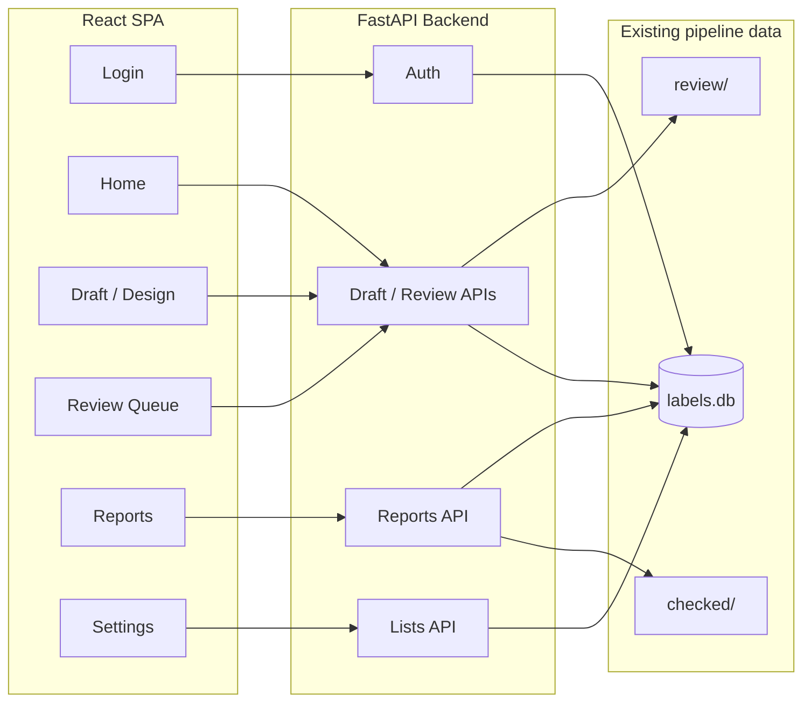

# Property Review Frontend – Implementation Plan

## Scope and constraints

- **React** for the frontend; **FastAPI** for the backend (Python, fits existing pipeline).
- **CLI and files unchanged**: You continue to run `run_month`, `review_month`, `finalize_month` manually; the app does not replace them. The deliverable remains the checked XLSX produced by `finalize_month`.
- **Reports**: Option A – backend runs the same aggregations as [3.0 MonthlySummary OCT25.ipynb](python/PropertyAnalytics_v2/3.0%20MonthlySummary%20OCT25.ipynb) on chosen month(s) and returns JSON.
- **Mobile and desktop**: Single responsive app (collapsible filters, table/cards, responsive charts).

---

## Architecture

- Backend uses [property_pipeline/config.py](property_pipeline/config.py) (`DB_PATH`, `CHECKED_DIR`, `REVIEW_DIR`, `GENERATED_DIR`) and reuses pipeline DB helpers and, where possible, pipeline functions (e.g. draft build, review apply).
- Report aggregations: extract the notebook’s `sumOf`, `get_pty_summary`, `get_outgoings`, `get_personal_spending_summary`, and a `load_data` that reads from `checked/` (and optionally DB for unfinalized months) into a new Python module used only by the API; API calls that module and returns JSON.

---

## 1. Backend (FastAPI)

**Location**: New package or module at repo root, e.g. `backend/` or `property_api/`, with its own `requirements.txt` (FastAPI, uvicorn, pandas, openpyxl; reuse `property_pipeline` as dependency or sibling package).

**Auth**

- Single shared password (env var, e.g. `REVIEW_APP_PASSWORD`). No user DB for v1.
- `POST /api/auth/login`: body `{ "password": "..." }`; if valid, return a signed token (e.g. JWT) or set session cookie; return 401 otherwise.
- Middleware or dependency: protect all routes under `/api` except `/api/auth/login`; validate token/cookie.

**Draft and review (read/write DB and review folder)**

- `GET /api/months` – list distinct `import_batch_id` from `transactions_canonical` (and optionally ensure draft/queue files exist).
- `GET /api/draft?month=OCT2025&property=&category=&subcategory=&search=` – return draft rows for month with optional filters. Implement by reusing pipeline logic: load canonical + latest labels (extend to include `confidence`, `needs_review` in label payload). Filter in backend by property/category/subcategory; optional `search` on memo/counterparty. Return JSON array of rows (e.g. Date, Account, Amount, Memo, Property, Cat, Subcat, tx_id, confidence, needs_review).
- `GET /api/review?month=OCT2025` – same as draft but only rows where latest label has `needs_review=1`; same filtering and column shape.
- `GET /api/lists` – return `{ "property_codes": [...], "categories": [...], "subcategories": [...] }` from DB (or [rules_seed.py](property_pipeline/rules_seed.py) + properties table).
- `POST /api/review/add` – body `{ "month": "OCT2025", "tx_ids": ["..."] }`. For each tx_id, insert a new label row: same property_code/category/subcategory as current latest, set `needs_review=1`, `source='manual'`, `confidence=1.0`, `reviewed=0`. Reuse DB pattern from [pipeline.py review_month](property_pipeline/pipeline.py) (new label version).
- `POST /api/review/remove` – body same; insert new label version with `needs_review=0`.
- `PATCH /api/labels` or `POST /api/review/correct` – body `{ "tx_id": "...", "property_code": "...", "category": "...", "subcategory": "..." }`. Insert new label version with `source='manual'`, `confidence=1.0`, `reviewed=1`, `needs_review=0`.
- `POST /api/review/submit?month=OCT2025` – apply “submit review”: for every row currently in review for that month (latest label `needs_review=1`), insert a new label version with current property/cat/subcat, `source='manual'`, `confidence=1.0`, `reviewed=1`, `needs_review=0`. Optionally write [review/review_queue_MMMYYYY.xlsx](property_pipeline/export.py) from current DB state so CLI `review_month` and the file-based workflow remain valid.
- Optional: `POST /api/finalize?month=OCT2025` – call pipeline’s `finalize_month` in-process (so you can trigger finalize from the UI without running the script). If not implemented, you keep running `finalize_month` from the command line.

**Reports (Option A – aggregations as JSON)**

- New module (e.g. `backend/report_aggregations.py` or under `property_pipeline`): implement `load_data(start, end)` that reads from `CHECKED_DIR` (and optionally from DB + build_output_dataframe for months not in checked/), returning a DataFrame with columns expected by the notebook (Date index, Account, Amount, Subcategory, Memo, Property, Description, Cat, Subcat). Implement `get_pty_summary(df)`, `get_outgoings(df)`, `get_personal_spending_summary(df)` (and any helpers like `sumOf`/`sumOfSubcat`) matching the notebook logic in [3.0 MonthlySummary OCT25.ipynb](python/PropertyAnalytics_v2/3.0%20MonthlySummary%20OCT25.ipynb); take care with date handling and column names so results match the notebook.
- `GET /api/reports/summary?from=OCT2025&to=NOV2025` (or `month=OCT2025` for single month). Backend: call `load_data` for the range, then run the three aggregation functions; return JSON (e.g. property summary per month, outgoings per month, personal spending per month). Structure the response so the frontend can render tables and charts (e.g. list of months with totals and breakdowns).

**Settings / Lists (optional)**

- `POST /api/lists/property` (and categories/subcategories) – add a new code to the appropriate store. If Lists are only in Excel today, either add a small DB table for “custom” list entries and merge with rules_seed in `GET /api/lists`, or append to a JSON file that the API and pipeline both read.

**CORS**: Allow the React origin (and localhost for dev). Use env for `DATA_PATH`/`DB_PATH` so the API points at the same `data/property` and DB as the pipeline.

---

## 2. Frontend (React)

**Setup**: Create app at repo root (e.g. `frontend/`) with Vite + React, TypeScript recommended. Use React Router, and a simple HTTP client (fetch or axios) with base URL pointing to the FastAPI server.

**Pages and routes**

| Route                  | Page                | Purpose                                                                                                                                                               |
| ---------------------- | ------------------- | --------------------------------------------------------------------------------------------------------------------------------------------------------------------- |
| `/` or `/login`        | Login               | Password form; on success store token and redirect to `/home`.                                                                                                        |
| `/home`                | Home                | Month dropdown (from `GET /api/months`); primary CTA “Review [month]” → `/review/:month`; “Review queue (N)” if N>0 → `/review/:month/queue`; “Reports” → `/reports`. |
| `/review/:month`       | Draft               | Full draft for month: filters, column picker, table (or cards on mobile), add/remove from review, inline edit, submit review.                                         |
| `/review/:month/queue` | Review queue        | Same as draft but only `needs_review=1`; no “add to review”; remove from review + submit.                                                                             |
| `/reports`             | Reports             | Month or range selector; “Apply” → fetch `GET /api/reports/summary`; display property summary, outgoings, personal spending (tables + charts).                        |
| `/settings`            | Settings (optional) | Forms to add new property code, category, subcategory; calls POST list endpoints.                                                                                     |

**Draft page (main UX)**

- **Toolbar**: Filters (Property, Category, Subcategory – multi-select from `GET /api/lists`); optional search (memo); “Columns” button opens modal/sheet to choose visible columns (Date, Account, Amount, Memo, Property, Cat, Subcat, Confidence, In review, etc.); persist column choice in localStorage.
- **Bulk actions**: Row selection (checkboxes); “Add selected to review” / “Remove from review” calling POST add/remove APIs.
- **Table**: Desktop – sortable table with checkbox column; mobile – horizontal scroll or card list with checkbox. Show “In review” badge or column. Optional: highlight rows by rule (e.g. low confidence / catch-all as “best guess”, missing property where required as “unusual”).
- **Row edit**: Inline dropdowns for Property, Cat, Subcat (same lists), or “Edit” → small modal; on save call PATCH/POST correct endpoint.
- **Footer**: “Submit review” button; show “X in review” and “Y selected”. Optional “Finalize month” if backend exposes it.
- **Link**: “Review queue (N)” to `/review/:month/queue`.

**Review queue page**

- Same filters and column picker; table/cards only for queue rows; “Remove from review”; “Submit review”.

**Reports page**

- Month dropdown or From/To; “Apply” triggers `GET /api/reports/summary`; render:
  - Property summary (Mortgage, PropertyExpense, ServiceCharge, OurRent, BealsRent, TotalRent, NetProfit) – table and optional bar chart.
  - Outgoings by category – table and optional stacked bar.
  - Personal spending by subcategory – table (and optional chart).
- Use a responsive chart library (e.g. Recharts) with `width: 100%` / aspect ratio so it works on mobile and desktop.

**Auth and layout**

- After login, store token in memory or httpOnly cookie (prefer cookie if same-origin). Axios/fetch: send credentials and (if using JWT) `Authorization` header.
- App layout: nav bar (Home, Reports, Log out); on small viewport use hamburger or bottom nav. Protect routes: if not authenticated, redirect to login.

**Responsive behaviour**

- Filters: collapsible panel or drawer on mobile.
- Tables: sticky first column + horizontal scroll, or switch to card layout on narrow width.
- Touch-friendly targets; no hover-only actions.

---

## 3. Suggested features (in scope)

- **Confidence and “In review”** in draft table and filters.
- **Bulk add by rule**: e.g. “Add all where Cat = OurRent and Property empty” (button that calls backend with a small rule descriptor or backend endpoint that computes tx_ids and then add).
- **Search**: Free-text filter on memo (and optionally counterparty) in draft/queue; backend `GET /api/draft` accepts `search=` and filters.
- **Date-in-month filter**: Optional query param on draft to filter by date range within the month.
- **Export**: “Download CSV” for current (filtered) draft or queue; backend can add `GET /api/draft?month=...&format=csv` (same data as JSON, CSV response) or generate client-side from JSON.
- **Audit**: “Last reviewed” or label history – either show `reviewed_at` from latest label in draft API, or add `GET /api/transactions/:tx_id/labels` for a detail view.
- **Highlights**: Optional “best guess” / “unusual” flags in draft API (from rule strength or confidence + missing property) and show badges or row styling in the UI.
- **New property/category/subcategory**: Settings page and POST list endpoints above.

---

## 4. File and data flow (no change to pipeline deliverables)

- **Run month**: You still run `python -m property_pipeline run_month OCT2025`; this populates DB and writes `generated/` and `review/review_queue_*.xlsx`. The app only reads/writes the same DB and can write an updated review queue XLSX on submit if desired.
- **Submit review**: App writes new label rows into `transactions_labels`; optionally updates `review/review_queue_MMMYYYY.xlsx`. You can still run `review_month OCT2025` from CLI if you prefer (file and DB stay consistent if the app writes the same file).
- **Final XLSX**: Either you run `finalize_month OCT2025` manually, or the app exposes “Finalize” and calls the same logic; output remains `checked/MMMYYYY_codedAndCategorised.xlsx` (and pipeline updates `generated/` draft). Reports API reads from `checked/` (and optionally DB for months not yet in checked).

---

## 5. Implementation order (suggested)

1. **Backend skeleton**: FastAPI app, auth (password), CORS, env for paths and password.
2. **Backend – draft and lists**: `GET /months`, `GET /draft`, `GET /review`, `GET /lists`; extend pipeline label loading so draft returns confidence and needs_review.
3. **Backend – review actions**: `POST /review/add`, `POST /review/remove`, `PATCH /api/labels` (or correct), `POST /review/submit`; optionally write review queue XLSX on submit.
4. **Frontend – auth and Home**: Login page, token handling, Home with month list and links to Review and Reports.
5. **Frontend – Draft page**: Load draft, filters, column picker, table/cards, add/remove from review, inline edit, submit review.
6. **Frontend – Review queue page**: Same as draft but queue-only and remove-from-review.
7. **Backend – reports**: Extract aggregation logic from notebook into a module; `load_data` from checked/ (and DB fallback); `GET /api/reports/summary` returning JSON.
8. **Frontend – Reports page**: Month/range picker, fetch summary, tables and charts.
9. **Polish**: Settings/Lists, export CSV, bulk-add-by-rule, search, date filter, highlights, audit info; responsive and a11y tweaks.

---

## 6. Key files to add or touch

- **New**: `backend/` (or `property_api/`) – main.py, auth, routers for draft/review/lists/reports, report_aggregations module; requirements.txt.
- **New**: `frontend/` – Vite+React app, pages (Login, Home, Draft, Queue, Reports, Settings), components (DraftTable, Filters, ColumnPicker, ReportCharts), API client, auth context.
- **Reuse**: [property_pipeline/db.py](property_pipeline/db.py), [property_pipeline/pipeline.py](property_pipeline/pipeline.py), [property_pipeline/export.py](property_pipeline/export.py), [property_pipeline/config.py](property_pipeline/config.py), [property_pipeline/rules_seed.py](property_pipeline/rules_seed.py). Report module may live under `property_pipeline` (e.g. `report_summary.py`) so it can use config and DB without duplicating paths.

No changes to the existing pipeline CLI behaviour or to the location of the final XLSX in `checked/`.